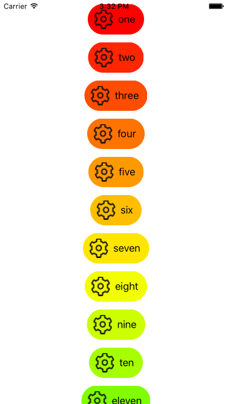
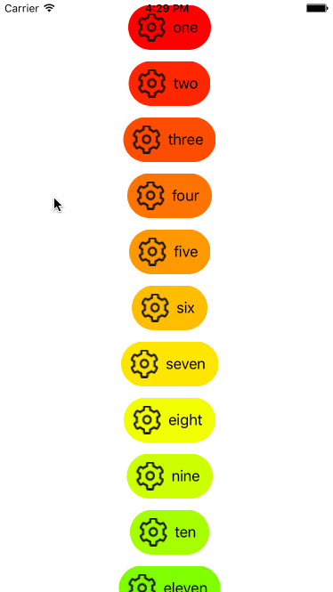

# TableView-Rounded-Cells

This example is an experiement to create a table view cell with a width that fits it's content. Cell content includes a Label, and ImageView. The background cells are rounded. The example covers a few concepts:

* Custom Table View Cells
* Constraints, and their constant values

#Overview

I have two videos on creating this example [here](https://www.youtube.com/watch?v=Dvp_6Rv6eRM&list=PLoN_ejT35AEjGsgK1L4x0Pzp7Msgtpdvz). 

The custom cell: RoundeTableViewCell has two child objects, a UILabel, and UIView. The UIView is behind the label, 
and the label is *not* a it's child. 

Constraints make this work. The label is constrained to center horizontal, and center vertical. Be sure to select the '
label use command+equal (cmd key + = key). This makes the label conform to it's width. Which makes sure the label will grow
in width as the text changes. 

The view behind the label, is constrained to the center also. This view's width is set equal to the label, and the same for 
the height. It's easier to do this in the outline view. Use the settings in the metric panel (on the right) to set a constant
value for the equal height, and equal width constraint. This makes the view expand away from the label, as if it has padding. 

RoundedTableViewCell is a custom class assigned to the custom cell. Make your own class by choosing File > New. Choose iOS > Cocoa Touch Class. Set Subclass of UITableViewCell. 

Make an IBOutlet for each the View and the Label in the cell.
I used the names specialLabel, and roundView. 

In your cellForRowAtIndexPath, this would be in the view controller hosting the table view that was using this cell. Make an
instance of the RoundTableViewCell class. Set the text of the specialLabel. Then round the corners of the roundView using it's layer.cornerRadius property. I calculated the rounding as: 

the height of the label + 20 (remember 20 px offset added to the constraint) / 2

## Adding an image view to the cell

The image view is added to the cell. Set it's constraints to the left of the label. This leaves the cell off center. Fix this
by offsetting the label from center by adding half the width of the imageview as a constant to the vertical center
constraint. The rounded background view now needs to encompass the image view. Add width of the imageview to the equalWidth
constraint. Then offset center x of the label by half this number. 

